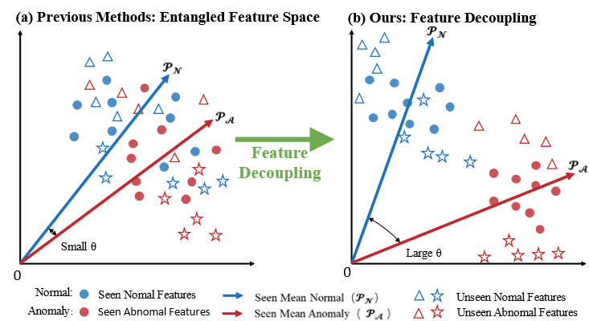

# DP-CLIP
DP-CLIP Official Pytorch Implementation
::: center

:::
## Abstract
Vision-Language Models have demonstrated immense potential in the field of Zero-Shot Anomaly Detection (ZSAD). However, their inherent semantic bias leads to a limited ability to distinguish between anomalous and normal features. To address this challenge, we propose DP-CLIP, a novel framework that leverages Feature Decoupling and Channel Purification to learn domain-agnostic discriminative representations. To explicitly separate normal and anomalous patterns, we introduce a momentum-guided feature decoupling mechanism. By utilizing the momentum mechanism to aggregate global prototypes, image features are forced to decouple from opposing prototypes in the latent space, thereby enlarging the distributional discrepancy between normal and abnormal instances. Furthermore, to enhance feature distinctiveness, we propose improved adapters and projection layers. These components effectively suppress redundant channel activations and refine feature representations while fine-tuning the original features, enabling the model to focus on anomaly-sensitive cues. Extensive experiments across multiple industrial and medical datasets demonstrate that DP-CLIP significantly outperforms existing methods, achieving superior generalization performance and detection accuracy.

## Visalization

## Quick Start 
### 1. Installation  
```bash
conda create -n dpclip python=3.10 -y  
conda activate dpclip  
pip install -r requirements.txt  
```
### 2. Datasets
The datasets can be downloaded from [MVTec-AD](https://www.mvtec.com/company/research/datasets/mvtec-ad/), [VisA](https://github.com/amazon-science/spot-diff), [MPDD](https://github.com/stepanje/MPDD), [BrainMRI, LiverCT, Retinafrom](https://drive.google.com/drive/folders/1La5H_3tqWioPmGN04DM1vdl3rbcBez62?usp=sharing) from [BMAD](https://github.com/DorisBao/BMAD), [CVC-ColonDB, CVC-ClinicDB, Kvasir, CVC-300](https://figshare.com/articles/figure/Polyp_DataSet_zip/21221579) from Polyp Dataset.
### 3. Evaluation
```bash
# evaluation
python test.py --save_path $save_path --dataset $dataset
# bash
bash test.sh
```
Model definition is in ``./model/``. We thank [```open_clip```](https://github.com/mlfoundations/open_clip.git) for being open-source. To run the code, one has to download the weight of OpenCLIP ViT-L-14-336px and put it under ```./model/```.

## Main Results
